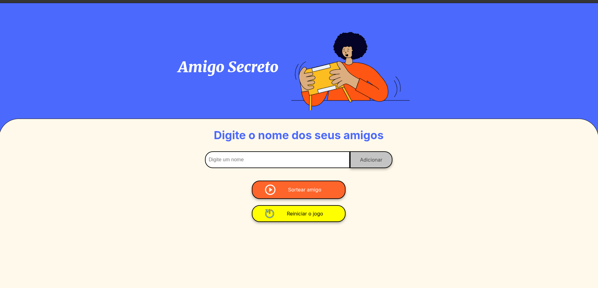

# Amigo-Secreto-ONE-
📌 Este é um projeto que tem a ideia de sortear nomes para ser o amigo secreto. 📌

🚀🚀🚀🚀🚀 Começamos na tela que pede para o usuário inserir nomes que sejam sorteados. 🚀🚀🚀🚀🚀

🎉 Agora só colocar o nome dos amigos e se divertir 🎉

💬 Podemos clicar com o mouse ou apertar o "Enter".💬

## Só preencher e descobrir quem vai ser o campeão

⚠️ E se houver erros na hora de inserir os dados? ⚠️

❌ Cliquei em "Adicionar" antes de inserir um nome? ❌ 
✔️ Na tela será exibido uma mensagem informando o ocorrido. ✔️
❌ Cliquei em "Sortear amigo" sem ter a lista de amigos? ❌ 
✔️ Será aberto um "alert" com a informação. ✔️
❌ Digitei um número em vez de um nome?❌ 
✔️ Será informado que foi um número e precisa ser um nome. ✔️

### Acabou? Só recomeçar!! Clicando no botão de reinicio! 

### Quer ver o projeto? 

